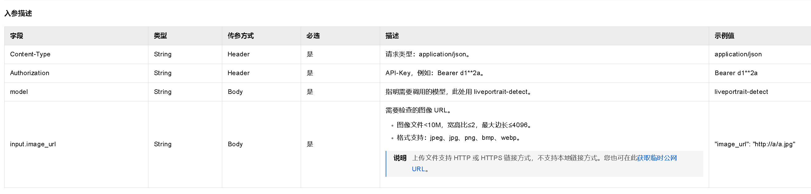
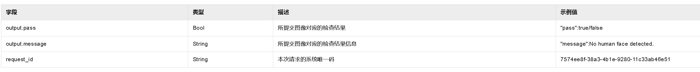

安装SDK
更新时间：2025-12-04 17:24:42
复制为 MD 格式
产品详情
我的收藏
您可以使用阿里云百炼官方的 DashScope SDK（支持 Python 和 Java），也可以通过 OpenAI 官方提供的多语言 SDK（如 Python、Node.js、Java、Go）来调用阿里云百炼的 OpenAI 兼容接口。

安装SDK
PythonJavaNode.jsGo
OpenAI
您可以在终端运行以下命令：

 
npm install --save openai
# 或者
yarn add openai
说明
如果安装失败，您可以通过配置镜像源的方法来完成安装，如：

 
npm config set registry https://registry.npmmirror.com/
配置镜像源后，您可以重新运行安装SDK的命令。

image

当终端出现added xx package in xxs的提示后，表示您已经成功安装OpenAI SDK。您可以使用npm list openai查询具体版本信息。

后续步骤
成功完成 SDK 的安装后，您可以：

查阅 模型列表选择适合您业务场景的模型。

使用文本生成模型、图像生成模型、视频生成模型、语音合成模型、语音识别模型、向量模型、排序模型开始构建您的应用。

了解 与 OpenAI API 的兼容性详情。

###上传音色
创建音色
上传用于复刻的音频，创建自定义音色。
RESTful API
基本信息
URL

 
https://dashscope.aliyuncs.com/api/v1/services/audio/tts/customization
请求方法

POST

请求头

 
Authorization: Bearer {api-key} // 需替换为您自己的API Key
Content-Type: application/json
消息体

包含所有请求参数的消息体如下，对于可选字段，在实际业务中可根据需求省略：

重要
model：声音复刻模型，固定为voice-enrollment

target_model：驱动音色的语音合成模型，须和后续调用语音合成接口时使用的语音合成模型一致，否则合成会失败

language_hints：指定用于提取目标音色特征的样本音频语种，仅适用于cosyvoice-v3-flash和cosyvoice-v3-plus模型

功能说明：该参数用于辅助模型识别样本音频（原始参考音频）的语种，从而更准确地提取音色特征，提升复刻效果。若设置的语言提示与实际音频语言不符（例如为中文音频设置 en），系统将忽略此提示，并依据音频内容自动检测语言。

取值范围：

zh：中文（默认值）

en：英文

fr：法语

de：德语

ja：日语

ko：韩语

ru：俄语

注意：此参数为数组，但当前版本仅处理第一个元素，因此建议只传入一个值。

 
{
    "model": "voice-enrollment",
    "input": {
        "action": "create_voice",
        "target_model": "cosyvoice-v3-plus",
        "prefix": "myvoice",
        "url": "https://yourAudioFileUrl",
        "language_hints": ["zh"]
    }
}
请求参数
点击查看请求示例

重要
model：声音复刻模型，固定为voice-enrollment

target_model：驱动音色的语音合成模型，须和后续调用语音合成接口时使用的语音合成模型一致，否则合成会失败

language_hints：指定用于提取目标音色特征的样本音频语种，仅适用于cosyvoice-v3-flash和cosyvoice-v3-plus模型

功能说明：该参数用于辅助模型识别样本音频（原始参考音频）的语种，从而更准确地提取音色特征，提升复刻效果。若设置的语言提示与实际音频语言不符（例如为中文音频设置 en），系统将忽略此提示，并依据音频内容自动检测语言。

取值范围：

zh：中文（默认值）

en：英文

fr：法语

de：德语

ja：日语

ko：韩语

ru：俄语

注意：此参数为数组，但当前版本仅处理第一个元素，因此建议只传入一个值。

 
curl -X POST https://dashscope.aliyuncs.com/api/v1/services/audio/tts/customization \
-H "Authorization: Bearer $DASHSCOPE_API_KEY" \
-H "Content-Type: application/json" \
-d '{
    "model": "voice-enrollment",
    "input": {
        "action": "create_voice",
        "target_model": "cosyvoice-v3-plus",
        "prefix": "myvoice",
        "url": "https://yourAudioFileUrl",
        "language_hints": ["zh"]
    }
}'
参数

类型

默认值

是否必须

说明

model

string

-

是

声音复刻模型，固定为voice-enrollment。

action

string

-

是

操作类型，固定为create_voice。

target_model

string

-

是

驱动音色的语音合成模型，推荐 cosyvoice-v3-flash 或 cosyvoice-v3-plus。

必须与后续调用语音合成接口时使用的语音合成模型一致，否则合成会失败。

prefix

string

-

是

为音色指定一个便于识别的名称（仅允许数字、大小写字母和下划线，不超过10个字符）。建议选用与角色、场景相关的标识。

该关键字会在复刻的音色名中出现，生成的音色名格式为：模型名-前缀-唯一标识，如cosyvoice-v3-plus-myvoice-xxxxxxxx。
url

string

-

是

用于复刻音色的音频文件URL，要求公网可访问。

language_hints

array[string]

["zh"]

否

指定用于提取目标音色特征的样本音频语种，仅适用于 cosyvoice-v3-flash 和 cosyvoice-v3-plus 模型。

功能说明：该参数用于辅助模型识别样本音频（原始参考音频）的语种，从而更准确地提取音色特征，提升复刻效果。若设置的语言提示与实际音频语言不符（例如为中文音频设置 en），系统将忽略此提示，并依据音频内容自动检测语言。

取值范围：

zh：中文（默认值）

en：英文

fr：法语

de：德语

ja：日语

ko：韩语

ru：俄语

注意：此参数为数组，但当前版本仅处理第一个元素，因此建议只传入一个值。

响应参数
点击查看响应示例

 
{
    "output": {
        "voice_id": "yourVoiceId"
    },
    "usage": {
        "count": 1
    },
    "request_id": "yourRequestId"
}
参数

类型

说明

voice_id

string

音色ID，可直接用于语音合成接口的voice参数。

查询音色列表
分页查询已创建的音色列表。
RESTful API
基本信息
URL

 
https://dashscope.aliyuncs.com/api/v1/services/audio/tts/customization
请求方法

POST

请求头

 
Authorization: Bearer {api-key} // 需替换为您自己的API Key
Content-Type: application/json
消息体

包含所有请求参数的消息体如下，对于可选字段，在实际业务中可根据需求省略：

重要
model为声音复刻模型，固定为voice-enrollment。

 
{
    "model": "voice-enrollment",
    "input": {
        "action": "list_voice",
        "prefix": "myvoice",
        "page_index": 0,
        "page_size": 10
    }
}
请求参数
点击查看请求示例

重要
model为声音复刻模型，固定为voice-enrollment。

 
curl -X POST https://dashscope.aliyuncs.com/api/v1/services/audio/tts/customization \
-H "Authorization: Bearer $DASHSCOPE_API_KEY" \
-H "Content-Type: application/json" \
-d '{
    "model": "voice-enrollment",
    "input": {
        "action": "list_voice",
        "prefix": "myvoice",
        "page_index": 0,
        "page_size": 10
    }
}'
参数

类型

默认值

是否必须

说明

model

string

-

是

声音复刻模型，固定为voice-enrollment。

action

string

-

是

操作类型，固定为list_voice。

prefix

string

null

否

音色自定义前缀，仅允许数字和小写字母，长度小于10个字符。

page_index

integer

0

否

页码索引，从0开始计数。

page_size

integer

10

否

每页包含数据条数。
响应参数
点击查看响应示例

 
{
    "output": {
        "voice_list": [
            {
                "gmt_create": "2024-12-11 13:38:02",
                "voice_id": "yourVoiceId",
                "gmt_modified": "2024-12-11 13:38:02",
                "status": "OK"
            }
        ]
    },
    "usage": {
        "count": 1
    },
    "request_id": "yourRequestId"
}
参数

类型

说明

voice_id

string

音色ID。

gmt_create

string

创建音色的时间。

gmt_modified

string

修改音色的时间。

status

string

音色状态：

DEPLOYING： 审核中

OK：审核通过，可调用

UNDEPLOYED：审核不通过，不可调用

查询指定音色
获取特定音色的详细信息

Python SDKJava SDKRESTful API
基本信息
URL

 
https://dashscope.aliyuncs.com/api/v1/services/audio/tts/customization
请求方法

POST

请求头

 
Authorization: Bearer {api-key} // 需替换为您自己的API Key
Content-Type: application/json
消息体

包含所有请求参数的消息体如下，对于可选字段，在实际业务中可根据需求省略：

重要
model为声音复刻模型，固定为voice-enrollment。

 
{
    "model": "voice-enrollment",
    "input": {
        "action": "query_voice",
        "voice_id": "yourVoiceId"
    }
}
请求参数
点击查看请求示例

重要
model为声音复刻模型，固定为voice-enrollment。

 
curl -X POST https://dashscope.aliyuncs.com/api/v1/services/audio/tts/customization \
-H "Authorization: Bearer $DASHSCOPE_API_KEY" \
-H "Content-Type: application/json" \
-d '{
    "model": "voice-enrollment",
    "input": {
        "action": "query_voice",
        "voice_id": "yourVoiceId"
    }
}'
参数

类型

默认值

是否必须

说明

model

string

-

是

声音复刻模型，固定为voice-enrollment。

action

string

-

是

操作类型，固定为query_voice。

voice_id

string

-

是

需要查询的音色ID。

响应参数
点击查看响应示例

 
{
    "output": {
        "gmt_create": "2024-12-11 13:38:02",
        "resource_link": "https://yourAudioFileUrl",
        "target_model": "cosyvoice-v3-plus",
        "gmt_modified": "2024-12-11 13:38:02",
        "status": "OK"
    },
    "usage": {
        "count": 1
    },
    "request_id": "2450f969-d9ea-9483-bafc-************"
}
参数

类型

说明

resource_link

string

被复刻的音频的URL。

target_model

string

驱动音色的语音合成模型，推荐 cosyvoice-v3-flash 或 cosyvoice-v3-plus。

必须与后续调用语音合成接口时使用的语音合成模型一致，否则合成会失败。

gmt_create

string

创建音色的时间。

gmt_modified

string

修改音色的时间。

status

string

音色状态：

DEPLOYING： 审核中

OK：审核通过，可调用

UNDEPLOYED：审核不通过，不可调用

音色配额与自动清理规则
总数限制：1000个音色/账号

当前接口不提供音色数量查询功能，可通过调用查询音色列表接口自行统计音色数目
自动清理：若单个音色在过去一年内未被用于任何语音合成请求，系统将自动将其删除

计费说明
声音复刻：创建、查询、更新、删除音色免费

使用复刻生成的专属音色进行语音合成：按量（文本字符数）计费，参见实时语音合成-CosyVoice/Sambert

版权与合法性
您需对所提供声音的所有权及合法使用权负责，请注意阅读服务协议。

错误码
如遇报错问题，请参见错误信息进行排查。

常见问题
功能特性
Q：如何调节自定义音色的语速、音量？
与使用预置音色完全相同。在调用语音合成API时，传入相应的参数即可，例如 speech_rate (Python) / speechRate (Java) 用于调节语速，volume 用于调节音量。详情请参见语音合成API文档（Java SDK/Python SDK/WebSocket API）

Q：除了Java和Python，其他语言（如Go, C#, Node.js）如何调用？
对于音色管理，请直接使用文档中提供的RESTful API。对于语音合成，请使用WebSocket API，并将复刻得到的 voice_id 作为 voice 参数传入。

故障排查
如遇代码报错问题，请根据错误码中的信息进行排查。

Q：为什么找不到 VoiceEnrollmentService 类？
SDK版本过低。请安装最新版SDK。

Q：声音复刻效果不佳，有杂音或不清晰怎么办？
这通常是由于输入音频质量不高导致的。请严格遵循录音操作指南重新录制并上传音频。

权限与认证
Q：使用子业务空间的API Key是否可以进行声音复刻？
需要为API Key对应的子业务空间进行模型授权后方才支持，详情请参见子业务空间的模型调用。

图中人脸检测生成视频功能

apikey=sk-31b6d616c209429faf6e85a70a8ecd4b

先把口播稿生成音频
用户上传音频后上传到rustfs服务器中，/audio/userid/xxx 文件夹下，然后通过外链传递给tts模型进行语音合成。

语音合成（Qwen-TTS）
# ======= 重要提示 =======
# 以下为北京地域url，若使用新加坡地域的模型，需将url替换为：https://dashscope-intl.aliyuncs.com/api/v1/services/aigc/multimodal-generation/generation
# 新加坡地域和北京地域的API Key不同。获取API Key：https://help.aliyun.com/zh/model-studio/get-api-key
# 若没有配置环境变量，请用阿里云百炼API Key将$DASHSCOPE_API_KEY替换为：sk-xxx。
# === 执行时请删除该注释 ===

curl -X POST 'https://dashscope.aliyuncs.com/api/v1/services/aigc/multimodal-generation/generation' \
-H "Authorization: Bearer $DASHSCOPE_API_KEY" \
-H 'Content-Type: application/json' \
-H 'X-DashScope-SSE: enable' \
-d '{
    "model": "qwen3-tts-flash",
    "input": {
        "text": "那我来给大家推荐一款T恤，这款呢真的是超级好看，这个颜色呢很显气质，而且呢也是搭配的绝佳单品，大家可以闭眼入，真的是非常好看，对身材的包容性也很好，不管啥身材的宝宝呢，穿上去都是很好看的。推荐宝宝们下单哦。",
        "voice": "Cherry",
        "language_type": "Chinese"
    }
}'
model string （必选）

模型名称，支持通义千问3-TTS-Flash和通义千问-TTS系列模型，详情请参见语音合成-通义千问。

推荐使用通义千问3-TTS-Flash，相比通义千问-TTS具备更强能力和更高并发限额。

text string （必选）

要合成的文本，支持中文、英文、中英混合输入。通义千问-TTS模型最长输入为512 Token。通义千问3-TTS-Flash模型最长输入为600字符。
**用户可以根据自己的需求输入框输入自己的口播内容进行修改，调整文本长度，以获得最佳的合成效果。**

voice string （必选）

使用的音色，参见支持的音色。
音色可以自己上传音频进行克隆

language_type string （可选）

指定合成音频的语种，默认为 Auto。

Auto：适用无法确定文本的语种或文本包含多种语言的场景，模型会自动为文本中的不同语言片段匹配各自的发音，但无法保证发音完全精准。

指定语种：适用于文本为单一语种的场景，此时指定为具体语种，能显著提升合成质量，效果通常优于 Auto。可选值包括：

Chinese

English

German

Italian

Portuguese

Spanish

Japanese

Korean

French

Russian

stream boolean （可选）默认值为 false

是否流式输出回复。参数值：

模型生成完后返回音频的 URL。

边生成边输出 Base64 编码格式的音频数据。您需要实时地逐个读取这些片段以获得完整的结果。请参见：实时播放。

该参数仅支持Python SDK。通过Java SDK实现流式输出请通过streamCall接口调用；通过HTTP实现流式输出请在Header中指定X-DashScope-SSE为enable。

返回对象（流式与非流式输出格式一致）
{
    "status_code": 200,
    "request_id": "5c63c65c-cad8-4bf4-959d-xxxxxxxxxxxx",
    "code": "",
    "message": "",
    "output": {
        "text": null,
        "finish_reason": "stop",
        "choices": null,
        "audio": {
            "data": "",
            "url": "http://dashscope-result-bj.oss-cn-beijing.aliyuncs.com/1d/ab/20251218/d2033070/39b6d8f2-c0db-4daa-9073-5d27bfb66b78.wav?Expires=1766113409&OSSAccessKeyId=LTAI5xxxxxxxxxxxx&Signature=NOrqxxxxxxxxxxxx%3D",
            "id": "audio_5c63c65c-cad8-4bf4-959d-xxxxxxxxxxxx",
            "expires_at": 1766113409
        }
    },
    "usage": {
        "input_tokens": 0,
        "output_tokens": 0,
        "characters": 195
    }
}
status_code integer

HTTP状态码。遵循 RFC 9110标准定义。例如：
• 200：请求成功，正常返回结果
• 400：客户端请求参数错误
• 401：未授权访问
• 404：资源未找到
• 500：服务器内部错误。

request_id string

本次请求的唯一标识。可用于定位和排查问题。

code string

请求失败时展示错误码（参见错误信息）。

message string

请求失败时展示错误信息（参见错误信息）。

output object

模型的输出。

属性

text string

始终为null，无需关注该参数。

choices string

始终为null，无需关注该参数。

finish_reason string

有两种情况：

正在生成时为"null"；

因模型输出自然结束，或触发输入参数中的stop条件而结束时为"stop"。

audio object

模型输出的音频信息。

属性

url string

模型输出的完整音频文件的URL，有效期24小时。

data string

流式输出时的Base64 音频数据。

id string

模型输出的音频信息对应的ID。

expires_at integer

url 将要过期的时间戳。

usage object

本次请求的 Token 或字符消耗信息。通义千问-TTS模型返回Token消耗信息，通义千问3-TTS-Flash模型返回字符消耗信息

属性

input_tokens_details object

输入文本的 Token消耗信息。仅通义千问-TTS模型返回该字段。

属性

text_tokens integer

输入文本的 Token 消耗量。

total_tokens integer

本次请求总共消耗的 Token 量。仅通义千问-TTS模型返回该字段。

output_tokens integer

输出音频的 Token 消耗量。对于通义千问3-TTS-Flash模型，该字段固定为0。

input_tokens integer

输入文本的 Token 消耗量。对于通义千问3-TTS-Flash模型，该字段固定为0。

output_tokens_details object

输出的 Token 消耗信息。仅通义千问-TTS模型返回该字段。

属性

audio_tokens integer

输出音频的 Token 消耗量。

text_tokens integer

输出文本的 Token 消耗量，当前固定为0。

characters integer

输入文本的字符数。仅通义千问3-TTS-Flash模型返回该字段。

request_id string

本次请求的 ID。

输入限制
图像格式为jpeg、jpg、png、bmp、webp。

图像文件<10M，宽高比≤2，最大边长≤4096像素。

上传图片仅支持HTTP链接方式，不支持本地链接方式。
入参描述

出参描述

检查不通过原因
No human face detected
未检测到人脸（包含人脸过小、侧脸、遮挡等情况）
请求示例
 
curl --location 'https://dashscope.aliyuncs.com/api/v1/services/aigc/image2video/face-detect' \
--header "Authorization: Bearer $DASHSCOPE_API_KEY" \
--header 'Content-Type: application/json' \
--data-raw '{
  "model": "liveportrait-detect",
  "input": {
      "image_url":"https://help-static-aliyun-doc.aliyuncs.com/file-manage-files/zh-CN/20250911/ynhjrg/p874909.png"
  }
}'
响应示例（通过）
 
{
    "output": {
        "pass": true,
        "message": ""
    },
    "usage": {
        "image_count": 1
    },
    "request_id": "a92e2ffd-9263-44ba-92c5-xxxxxx"
}
响应示例（不通过）
 
{
    "output": {
        "pass": false,
        "message": "No human face detected."
    },
    "usage": {
        "image_count": 1
    },
    "request_id": "c56f62df-724e-9c19-96bd-xxxxxx"
}
响应示例（错误）
 
{
    "code": "InvalidParameter.UnsupportedFileFormat",
    "message": "Input files format not supported.",
    "request_id": "788b30fe-05f6-999f-a0b1-xxxxxx"
}

检测通过后，请调用[人像生成视频](https://help.aliyun.com/document_detail/149908.htm)服务，将检测结果作为入参传入。
LivePortrait 视频生成
模型概览
liveportrait是一个人物视频生成模型，可基于人物肖像图片和人声音频文件，快速、轻量化地生成人物肖像动态视频。
HTTP调用接口
功能描述
用于生成人物肖像动态视频。

前提条件
已开通阿里云百炼服务并获得API-KEY：获取与配置 API Key。

输入图像已通过LivePortrait 图像检测检测。

输入限制
图像格式：格式为jpeg、jpg、png、bmp、webp。

图像分辨率：图像文件<10M，宽高比≤2，最大边长≤4096像素。

音频格式：格式为wav、mp3。

音频限制：文件＜15M，1s＜时长＜3min。

音频内容：音频中需包含清晰、响亮的人声语音，并去除了环境噪音、背景音乐等声音干扰信息。

上传图片、音频链接仅支持HTTP链接方式，不支持本地链接方式。

作业提交接口
POST https://dashscope.aliyuncs.com/api/v1/services/aigc/image2video/video-synthesis/
因该算法调用耗时较长，故采用异步调用的方式提交任务。

任务提交之后，系统会返回对应的作业ID，后续可通过“作业任务状态查询和结果获取接口”获取任务状态及对应结果。
入参描述

字段

类型

传参方式

必选

描述

示例值

Content-Type

String

Header

是

请求类型：application/json。

application/json

Authorization

String

Header

是

API-Key，例如：Bearer d1**2a。

Bearer d1**2a

X-DashScope-Async

String

Header

是

使用enable，表明使用异步方式提交作业。

enable

model

String

Body

是

指明需要调用的模型，此处用liveportrait。

liveportrait

input.image_url

String

Body

是

用户上传的图片 URL，该图应先通过LivePortrait图像检测API。

图像文件<10M，宽高比≤2，最大边长≤4096。

格式支持：jpeg、jpg、png、bmp、webp。

说明
上传文件支持HTTP或HTTPS链接方式，不支持本地链接方式。您也可在此获取临时公网URL。

"image_url": "http://a/a.jpg"

input.audio_url

String

Body

是

用户上传的音频文件 URL。

音频文件＜15M，1s＜时长＜3min。

格式支持：wav、mp3。

说明
上传文件支持HTTP或HTTPS链接方式，不支持本地链接方式。您也可在此获取临时公网URL。

http://aaa/bbb.wav

parameters.template_id

String

Body

否

可按模板控制人物头部的运动姿态和幅度，当前支持3种模板：normal、calm、active。默认为normal。

"normal"

parameters.eye_move_freq

Float

Body

否

每秒眨眼次数，可设值为0-1，值越大眨眼频率越高。默认值为0.5。

0.5

parameters.video_fps

Integer

Body

否

输出视频帧率，可设值为15-30。默认值为24。

24

parameters.mouth_move_strength

Float

Body

否

嘴部动作的幅度大小，可设值为0-1.5，值越大嘴型越大。若设为0则嘴部无动作。默认值为1。

1

parameters.paste_back

Boolean

Body

否

生成的人脸是否贴回原图，可设值为true或false。若设为false则仅输出生成的人脸，忽略人物身体。默认值为true。

true

parameters.head_move_strength

Float

Body

否

头部动作幅度，可设值为0-1，值越大头部动作幅度越大。默认值为0.7。

0.7

出参描述

字段

类型

描述

示例值

output.task_id

String

提交异步任务的作业id，实际作业结果需要通过异步任务查询接口获取。

a8532587-fa8c-4ef8-82be-0c46b17950d1

output.task_status

String

提交异步任务后的作业状态。

“PENDING”

request_id

String

本次请求的系统唯一码。

7574ee8f-38a3-4b1e-9280-11c33ab46e51

可选用的动作模板

template_id

效果说明

normal

默认动作模板，头部动作幅度适中。适用于多种场景。

calm

人物表现平静，头部动作幅度较小。推荐用于播报等场景。

active

人物表现活泼，头部动作幅度较大。推荐用于演唱等场景。

请求示例
 
curl --location 'https://dashscope.aliyuncs.com/api/v1/services/aigc/image2video/video-synthesis/' \
--header 'X-DashScope-Async: enable' \
--header "Authorization: Bearer $DASHSCOPE_API_KEY" \
--header 'Content-Type: application/json' \
--data '{
    "model": "liveportrait",
    "input": {
        "image_url": "https://help-static-aliyun-doc.aliyuncs.com/file-manage-files/zh-CN/20250911/ynhjrg/p874909.png",
        "audio_url": "https://help-static-aliyun-doc.aliyuncs.com/file-manage-files/zh-CN/20251226/fwnqyq/liveportrait_boy.mp3"
    },
      "parameters": {
         "template_id": "normal",
         "eye_move_freq": 0.5,
         "video_fps":30,
         "mouth_move_strength":1,
         "paste_back": true,
         "head_move_strength":0.7
    }
  }'
响应示例
 
{
    "output": {
	"task_id": "a8532587-fa8c-4ef8-82be-0c46b17950d1", 
    	"task_status": "PENDING"
    },
    "request_id": "7574ee8f-38a3-4b1e-9280-11c33ab46e51"
}
作业任务状态查询和结果获取接口
 
GET https://dashscope.aliyuncs.com/api/v1/tasks/{task_id}
入参描述

字段

类型

传参方式

必选

描述

示例值

Authorization

String

Header

是

API-Key，例如：Bearer d1**2a。

Bearer d1**2a

task_id

String

Url Path

是

需要查询作业的 task_id。

a8532587-fa8c-4ef8-82be-0c46b17950d1

出参描述

字段

类型

描述

示例值

output.task_id

String

查询作业的 task_id。

a8532587-fa8c-4ef8-82be-0c46b17950d1

output.task_status

String

被查询作业的作业状态。

任务状态：

PENDING 排队中

RUNNING 处理中

SUCCEEDED 成功

FAILED 失败

UNKNOWN 作业不存在或状态未知

output.results.video_url

String

如果作业成功，包含模型生成的结果 object，然后每个 object 中包含按照要求生成的结果地址。video_url有效期为作业完成后24小时。

https://xxx/1.mp4

usage.video_duration

Float

本次请求生成视频时长计量，单位：秒。

10.23

usage.video_ratio

String

本次请求生成视频的画幅类型，该值为standard。

"video_ratio": "standard"

request_id

String

本次请求的系统唯一码。

7574ee8f-38a3-4b1e-9280-11c33ab46e51

请求示例
将86ecf553-d340-4e21-xxxxxxxxx替换为真实的task_id。

 
curl -X GET https://dashscope.aliyuncs.com/api/v1/tasks/86ecf553-d340-4e21-xxxxxxxxx \
--header "Authorization: Bearer $DASHSCOPE_API_KEY"
响应示例（作业成功执行完毕）
 
{
    "request_id": "b64e9c68-3923-462d-b25a-xxxxxx",
    "output": {
        "task_id": "a1c69ca5-810b-49ae-8b20-xxxxxx",
        "task_status": "SUCCEEDED",
        "submit_time": "2025-12-26 11:33:03.146",
        "scheduled_time": "2025-12-26 11:33:13.312",
        "end_time": "2025-12-26 11:33:22.455",
        "results": {
            "video_url": "http://dashscope-result-sh.oss-cn-shanghai.aliyuncs.com/xxx.mp4?Expires=xxx"
        }
    },
    "usage": {
        "video_duration": 2.79,
        "video_ratio": "standard"
    }
}
响应示例（作业失败）
 
{
    "request_id": "7574ee8f-38a3-4b1e-9280-xxxxxx",
    "output": {
        "task_id": "a8532587-fa8c-4ef8-82be-xxxxxx", 
    	"task_status": "FAILED",
    	"code": "xxx", 
    	"message": "xxxxxx"
    }  
}